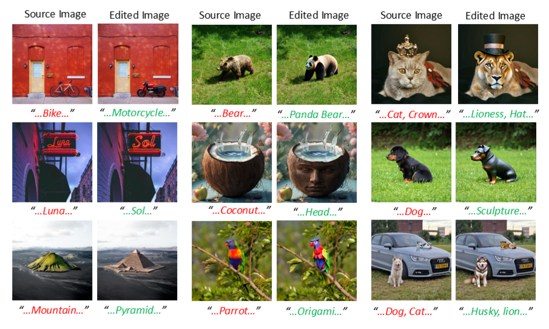

# SAM-Flow

<a href='https://arxiv.org/abs/2406.03293'></a> 
 ### Official Pytorch implementation of the paper: "SAM-Flow: Source-Anchored Masked Flow for Training-Free Image Editing"
 <em>by Haowang Cui, Rui Chen, Tao Luo, Tao Guo, Zheng Qin, Jiaze Wang.</em>
 </p><p style='text-align: justify;'> 
 



## Repository Layout

```text
configs/              Default FLUX and SD3 configs
examples/             Dataset YAML template
sam_flow/             Model, FlowEdit, and utility code
scripts/run_image.py  Run one custom image and prompt pair
scripts/run_dataset.py Run a YAML dataset of edit cases
requirements.txt      Python dependencies
```

## Installation

```bash
git clone <https://github.com/chwbob/Sam-Flow>
cd SAM-Flow
python -m venv .venv
.venv\Scripts\activate
pip install -r requirements.txt
```

Linux/macOS activation:

```bash
source .venv/bin/activate
```

FLUX.1-dev and Stable Diffusion 3 Medium require access through Hugging Face. Log in before running:

```bash
huggingface-cli login
```

## Run One Image

Use `scripts/run_image.py` to test your own image and prompts without creating a dataset file.

```bash
python scripts/run_image.py ^
  --mode flux ^
  --image path\to\input.png ^
  --source-prompt "a photo of a red car parked on a street" ^
  --target-prompt "a photo of a blue car parked on a street" ^
  --source-token red --source-token car ^
  --target-token blue --target-token car ^
  --target-code blue_car ^
  --output-root results
```

For edits where it is easier to say what should stay unchanged, use `--unchanged-token` instead of source and target mask tokens:

```bash
python scripts/run_image.py ^
  --mode flux ^
  --image path\to\input.png ^
  --source-prompt "a woman wearing a red dress in a garden" ^
  --target-prompt "a woman wearing a blue dress in a garden" ^
  --unchanged-token woman --unchanged-token garden ^
  --target-code blue_dress
```

Outputs are written to:

```text
results/<image_name>/<target_code>/
```

Each case contains the generated scout image, final edited image, copied source image, and `case.yaml` manifest.

## Run A Dataset

Create a YAML file like [examples/dataset.yaml](examples/dataset.yaml). The `dataset.root` field in the config is used as the base directory for relative `init_img` paths.

Then run:

```bash
python scripts/run_dataset.py --mode flux --config configs/flux.yaml
```

You can filter dataset runs:

```bash
python scripts/run_dataset.py --mode flux --image-name input --target-code blue_car
```

## Configuration

Main config files:

- [configs/flux.yaml](configs/flux.yaml)
- [configs/sd3.yaml](configs/sd3.yaml)

Useful fields:

- `models.flux_model_id` or `models.sd3_model_id`: backbone model ID.
- `results.root`: output directory.
- `run.device`: `auto`, `cuda`, or `cpu`.
- `run.dtype`: `auto`, `float16`, or `float32`.
- `run.save_debug_maps`: set `true` to save attention and mask maps for inspection.
- `flowedit`: scout image generation settings.
- `sam_flow`: complete SAM-Flow model settings.

## Notes

- For best results, resize input images to a resolution supported by the backbone and your GPU memory.
- Mask tokens should appear in the corresponding prompt. For example, if the target prompt says "blue car", pass `--target-token blue --target-token car`.
- The complete model is the default and only release path; ablation switches were intentionally removed from this version.


## Credits

SAM-Flow is built on the official code of FlowEdit:
- **[FlowEdit](https://github.com/fallenshock/FlowEdit)**

### Citation
If you use this code for your research, please cite our paper:

```
@inproceedings{kulikov2025flowedit,
  title={Flowedit: Inversion-free text-based editing using pre-trained flow models},
  author={Kulikov, Vladimir and Kleiner, Matan and Huberman-Spiegelglas, Inbar and Michaeli, Tomer},
  booktitle={Proceedings of the IEEE/CVF International Conference on Computer Vision},
  pages={19721--19730},
  year={2025}
}
```
